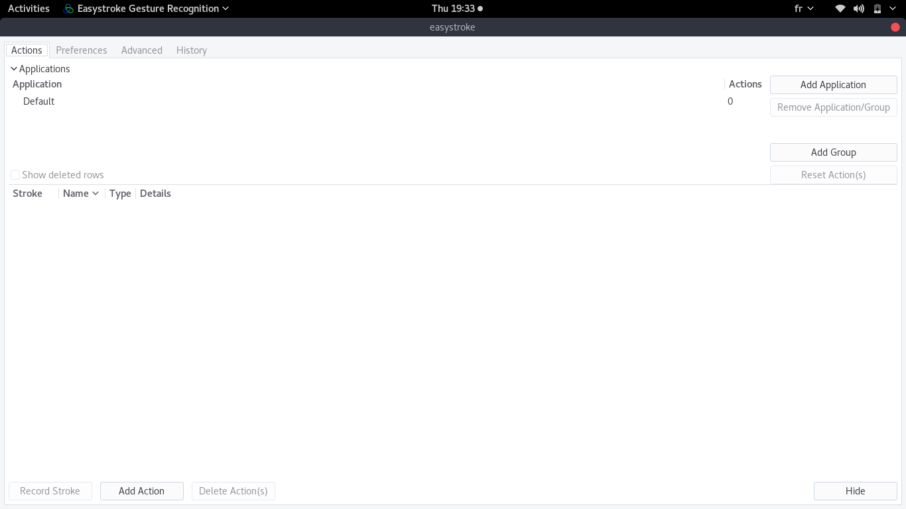

# A propos
Salut, 
Ce dépot me permettra de retrouver mes commandes et certaines astuces d'installation d'outils pour mon OS linux si jamais je réinitialisais mon ordi. ;)

# Trucs et Astuces
## Remapper les boutons de la souris avec le logiciel easystroke
### Installation
Lien d'installation: http://www.timelessguru.com/easystroke (consulté le 16/08/2018)
```
sudo apt-get install easystroke wmctrl xdotool
```

### Capture


## Remapper touches du clavier via la commande `xmodmap`
### Installation
Lien d'installation: https://wiki.archlinux.org/index.php/Xmodmap

### Utilisation pour pour remplacer la touche puissance 2 par un back-tick(`). Sur clavier AZERTY genre raccourcie :)
```
# On génère le fichier de map
xmodmap -pke > ~/.Xmodmap
# On trouve la clef a remap
xev | awk -F'[ )]+' '/^KeyPress/ { a[NR+2] } NR in a { printf "%-3s %s\n", $5, $8 }'
# On modifie le fichier Xmodmap et on teste avec
xmodmap ~/.Xmodmap
```

## Trouver le processus qui occupe un port
```
sudo netstat -nlp | grep :80
```